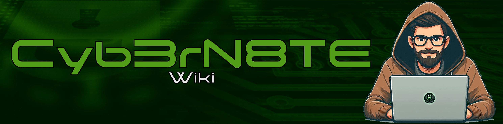

# Welcome

<figure><figcaption></figcaption></figure>

## G'day Champions 🏆 - Welcome to the Cyb3rN8TE Wiki 

This wiki serves as a repository of knowledge acquired through four years of hands-on experience in the information technology and cybersecurity field.

Having worked as a systems administrator, junior security analyst, and malware analyst, I have gained extensive exposure to various software tools, hardware, attack/defence procedures, and security best practices.

IT alone involves a vast amount of continuous learning, and adding cybersecurity on top of that makes it feel almost impossible to keep up. I wanted to create a centralised system where I can safely and effectively document everything I've learned in a structured way. The goal is to have an easily accessible resource to recall important information, like scripts, software usage, attack methods, and defence strategies, whenever needed.

At some point, I realised that this wiki could be a valuable way to give back to the industry. I felt immensely grateful for the opportunity to build a career in cybersecurity, especially considering the extremely competitive nature of the market. It almost felt like a miracle that a non-graduate, working in hospitality, could break into the industry.

From conversations with industry professionals, reading forums, and my own experiences, it’s clear that many businesses lack a proper structure to support newcomers in the field of cybersecurity. This can include inadequate training, limited promotion opportunities, restrictions on learning experiences, and a lack of a structured knowledge base or training program. I created this wiki to provide guidance for others who may be facing similar challenges.

I hope you find the information in this wiki beneficial. Feel free to reach out to me via my socials at any time if you want to chat about the industry or just have a friendly chat.

Cheers,

Nathan

## Disclaimer 


The information contained in this wiki is for educational purposes only. While I strive to provide accurate and up-to-date information, I do not endorse the use of any code, techniques, or methodologies for illegal activities. It is your responsibility to ensure that you comply with all applicable laws and regulations. I will not be held responsible for any misuse of the information provided in this wiki.


