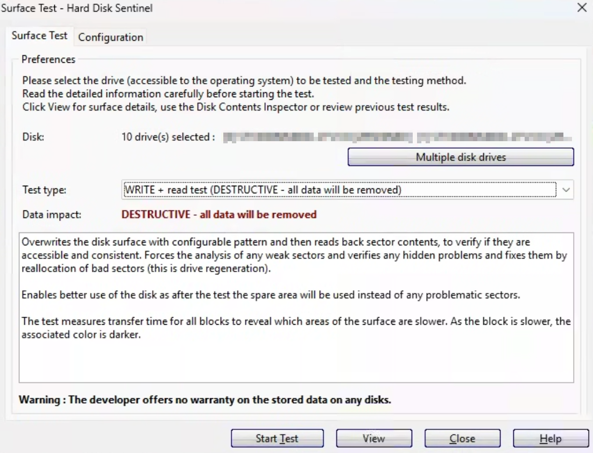

# Hard disk drive

Before deploying any hard disk drive, especially in critical environments like servers or NAS, it is essential to perform preliminary testing. These days, manufacturers conduct thorough factory testing such as surface scans, firmware validation, and mechanical calibration to ensure each drive meets quality standards before shipping. However, damage during transport, early-life failures ("infant mortality"), or compatibility issues can still occur. Passing all preliminary tests doesn’t guarantee that the drive won’t fail, it simply gives us confidence that we’re not introducing a disk that’s already faulty or likely to degrade immediately. It confirms the drive is healthy at the time of testing, but like any piece of hardware, it could still fail a week later, a month later, or continue running reliably for years.

## Step 1: Check SMART Results

The first step is to check the SMART (Self-Monitoring, Analysis, and Reporting Technology) results of the drive. This gives an initial indication of the drive's overall health by displaying various critical metrics. Specifically, look for the following key parameters:

1. **Power-On Hours (POH)**: Indicates how many hours the drive has been in operation. A very high number could suggest the drive is nearing the end of its lifespan.
2. **Reallocated Sector Count**: This is a critical value, as it shows how many bad sectors have been found and remapped by the drive. A non-zero value or a growing count suggests the drive may be failing.
3. **Current Pending Sector Count**: This represents sectors that are unstable or unreadable. The drive may attempt to reallocate these sectors, but if the count increases over time, it’s a red flag for imminent failure.
4. **Uncorrectable Sector Count**: Indicates the number of sectors that couldn't be recovered after several attempts. This is an important metric for data integrity—higher values indicate potential reliability problems.
5. **Seek Error Rate**: A high rate of seek errors can signal mechanical problems with the drive’s actuator or heads, which could lead to physical failure.
6. **Spin Retry Count**: Shows how many times the drive has had to retry spinning up. A high value here can indicate motor or bearing problems.
7. **Temperature**: Check to see if the drive has been subjected to sustained high temperatures (check disk spec sheet but normally above 40-50°C), as this can prematurely wear the drive's components and reduce its lifespan. If the temperature has consistently been in this range, the drive may be at risk of early failure.


Keep in mind that if you are working with a refurbished, recertified, or previously used drive, the SMART values might have been wiped during the refurbishing process. In such cases, you may not have the full history of the drive's performance, which makes it harder to gauge how the drive has been stressed in its previous life.&#x20;


## Step 2: Run a Long SMART Test

After reviewing the SMART results, the next step is to run a long SMART test. This test performs a detailed surface scan of the drive, checking for physical defects like bad sectors, reallocated sectors, and other critical errors that could affect the drive’s performance and reliability. It writes test patterns to each sector, then reads them back to verify the integrity of the data and checks for issues like errors during writing, sector reallocation, or read failures. This test typically takes several hours depending on the drive's capacity and speed. Take note of the results as a benchmark, as these will be essential when comparing the drive's performance after applying additional stress during later tests. Any errors or warnings at this stage should be carefully reviewed, as they may indicate imminent hardware failure.

## Step 3: Surface Test

The next step is to run a surface test to thoroughly assess the physical condition of the drive. This helps uncover weak sectors, inconsistencies, and hidden faults that may not have been triggered during earlier testing phases. Hard Disk Sentinel is the preferred tool for this task due to its user-friendly graphical interface, real-time visual feedback, and ability to clearly display problematic or slow areas on the disk.

While alternatives like badblocks exist on Linux, they are considered somewhat outdated and are more cumbersome to use. Running badblocks typically requires working in a terminal multiplexer like tmux to keep the test running in the background, and careful attention to device designations (e.g., `/dev/sdX`), which, if chosen incorrectly, can lead to accidental data loss or system corruption. These added complexities make badblocks less accessible, especially when compared to the GUI-driven approach of Hard Disk Sentinel.

For this step, you should select a sequential Write + Read test. This test overwrites the entire disk surface with a configurable pattern, then reads it back to verify that all sectors are accessible and consistent. It forces the drive to internally analyse any weak sectors and reallocate them from the spare area if necessary—a process sometimes referred to as drive regeneration. This not only validates the integrity of each block but also ensures that problematic sectors are retired from use.

The recommended pattern is 0xAA 0x55 0xAA 0x55, which alternates bits (10101010 and 01010101) to stress every bit in the sector. This is highly effective for detecting stuck bits, stressing the write circuitry, and revealing errors that simple patterns like all-zero or all-one might miss. It also avoids pitfalls where HBAs (Host Bus Adapters) or drive firmware may ignore trivial write patterns like all-zero, which can lead to incomplete testing.

<figure><figcaption></figcaption></figure>

<figure><figcaption></figcaption></figure>

## **Step 4: Run Another Long SMART Test**

After completing the surface test, it’s important to run a **second long SMART test**. This follow-up test helps verify whether the surface test caused any changes or revealed new issues with the drive. Since the surface test involved full-disk write and read operations, potentially triggering weak or unstable sectors, this second long SMART test allows us to detect if any SMART attributes have changed, such as increases in:

* Reallocated Sector Count
* Current Pending Sector Count
* Uncorrectable Sector Count
* CRC Errors or
* Read/Write Error Rates

These changes could indicate that the drive is struggling under stress and may be prone to future failure.

Compare the results of this test with those from the initial long SMART test (Step 2). Any increase in error counts or new warnings should be considered a serious red flag. Even if the drive appears to function normally, small changes in SMART data can hint at underlying mechanical or electronic issues that might worsen with continued use.

This step serves as a final health checkpoint before the drive is cleared for use. If the SMART status remains clean and all critical attributes are unchanged, you can have greater confidence that the drive is stable and ready for deployment.
